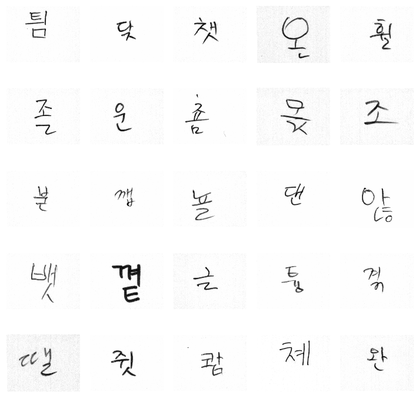
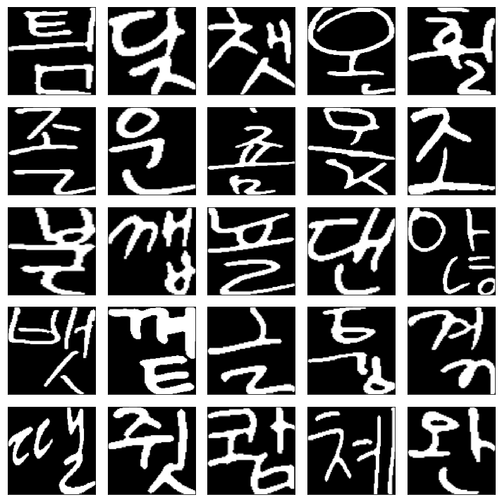
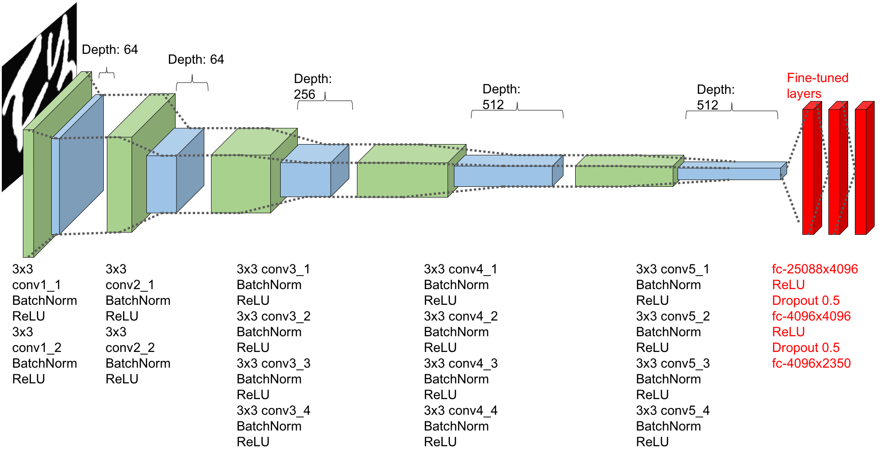
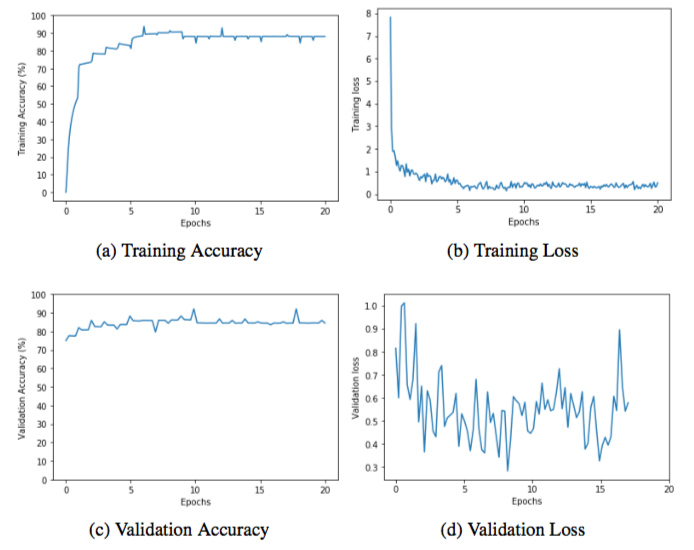

Korean Character Recognition
==============================
## Overview
This project is building a model to recognize 2,350 handwritten hangul labels using VGG-19 CNN model. We use transfer learning method to save times for the training.
Over 2,000,000 of handwritten characters were used to train the model.

## Getting Started
* Install the python libraries. (See requirements.txt)
	pip install -r requirements.txt
* Download the dateset
	You can download the dataset with permission from the [EIRIC](https://www.eiric.or.kr/special/special.php#).
* PyTorch was used in this code. We can use TensorBoard for the visulalization in PyTorch. For more information, visit [https://github.com/yunjey/pytorch-tutorial/tree/master/tutorials/04-utils/tensorboard](https://github.com/yunjey/pytorch-tutorial/tree/master/tutorials/04-utils/tensorboard).

## How It Works
1. Preprocess the images
The images are variant in resolutions while the model needs a consistent input size, 224 × 224. We need to remove the noises in the images and crop the images into 224 x 224. There are four steps to preprocess the images for them to be feeded into the model.

* Remove noises from the images with median filters
* Normalize the pixels of the image in range of [0,1]
* Crop the images
* Resize the images to 224 x 224

### Before preprocessing

### After preprocessing

### Preprocessing steps

2. Build the model
VGG-19 model is used in this project. The VGG-19 model was trained on ImageNet data for 1,000 number of classes. Here, we modify the number of classes from 1,000 to 2,350 which is the number of different Korean characters we want to classify.

3. Experiments and Result
3.1. Training Setups
* Number of Training Images: 1,280,218 (60%)
* Number of Validation Images: 426,738 (20%)
* Number of Test Images: 426,738 (20%)
* Optimizer: Adam optimizer (betas=(0.9, 0.999), eps=1e-08)
* Learning rate: 0.0001 (decay by a factor of 0.05 every 5 epochs)
* Number of epochs: 20
* Batch size: 128

3.2. Result
We achieved 96.69% of training accuracy and 84.57% of test accuracy.

3.3. Limitations
The classifier was confused about the following cases.
* Too bold examples
* Too similar characters

Possible solutions?
We may mitigate the problems if we train models for consonants and vowels separately and combine together for inference.
Then we need **Object Detection** and **Object Localization** models to discriminate the consonants and vowels in the initial stage.
