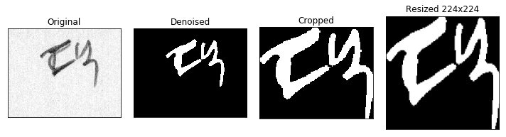

Korean Character Recognition
==============================
## Overview
This project is building a model to recognize 2,350 handwritten hangul labels using VGG-19 and Inception V3 models.
Over 2,000,000 images of handwritten characters were used to train the model.

## Getting Started
* Install the python libraries. (See requirements.txt)
	pip install -r requirements.txt
* Download the dateset
	You can download the dataset with permission from the [EIRIC](https://www.eiric.or.kr/special/special.php#).
* PyTorch was used in this code. We can use TensorBoard for the visulalization in PyTorch. For more information, visit [https://github.com/yunjey/pytorch-tutorial/tree/master/tutorials/04-utils/tensorboard](https://github.com/yunjey/pytorch-tutorial/tree/master/tutorials/04-utils/tensorboard).

## How It Works
### Preprocess the images

* The images are variant in resolutions while the model needs a consistent input size. We need to remove the noises in the images and crop the images. There are four steps to preprocess the images for them to be feeded into the model.

- Remove noises from the images with median filters
- Normalize the pixels of the image in range of [0,1]
- Crop the images
- Resize the images to 224 x 224 for VGG-19, to 149 x 149 for Inception V3

**Before preprocessing**

**After preprocessing**

**Preprocessing steps**

## Build the model
VGG-19 and Inception V3 models are used in this project. We usually need a lot of computation power to train VGG-19 model because it has many parameters (149 million) to be learned. Thus, we will fine tuning the last three fully connected layers and freeze the parameters in the conv layers.

Inception V3 network is one of the state-of-the-art CNN network and it shows very good performance in image classification tasks. Since Inception V3 has less number of parameter (29 million) compared to VGG-19, we will not use fine-tuning method for this model. We will use a bit different sizes of layers from the standard inception V3 model since **1) the input has single channel (gray image), 2) average input size is less than the original input size of the inception network (299 x 299)**. We will convert the images to 149 x 149 x 1 to be fed into the customized Inception V3 network.

## Experiments and Result
### Training Setups
* Number of Training Images: 1,280,218 (60%)
* Number of Validation Images: 426,738 (20%)
* Number of Test Images: 426,738 (20%)
* Optimizer: Adam optimizer (betas=(0.9, 0.999), eps=1e-08)
* Learning rate: 0.001 (decay by a factor of 0.1 every epoch)
* Number of epochs: 20 (VGG-19), 3 (Inception-v3)
* Batch size: 128

### Result
Inception-v3 shows much better performance in training time and accuracy.

|     Model     | Test Accuracy |
| :------------:| ----------: |
| VGG-19        |    84.57%   |
| Inception-v3  |    96.26%   |

## Limitations
The classifier was confused about the following cases.
* Too bold examples
* Too similar characters

### Possible solutions?
We may mitigate the problems if we train models for consonants and vowels separately and combine together for inference.
Then we need **Object Detection** and **Object Localization** models to discriminate the consonants and vowels in the initial stage.
